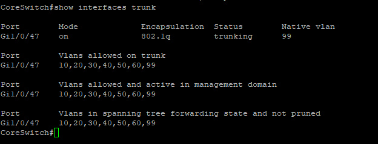
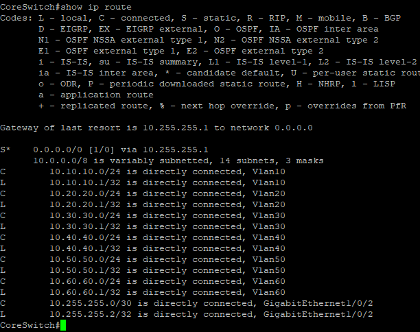
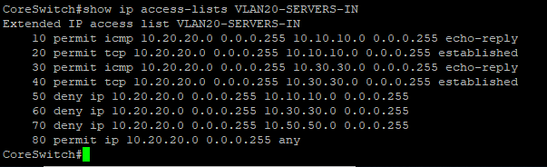

# Network Infrastructure

This section documents the physical and logical network infrastructure used in my HomeLab.

The environment uses Cisco Catalyst switching to provide VLAN segmentation, Layer 2 connectivity, and Layer 3 routing between network segments.

## Core Technologies

- Cisco Catalyst 3850 Layer 3 core switch
- Cisco Catalyst 3750 access switch
- Cisco IOS / IOS XE
- VLANs
- 802.1Q trunking
- Switch Virtual Interfaces (SVIs)
- Inter-VLAN routing
- Spanning Tree Protocol
- Static routing
- Ethernet access ports
- TCP/IP networking

## Network Segmentation

| VLAN | Purpose |
|------|---------|
| 10 | Management |
| 20 | Servers |
| 30 | Clients |
| 40 | Storage |
| 50 | DMZ |
| 60 | Additional Services |
| 99 | Native VLAN |

## Skills Demonstrated

- Configuring and verifying VLANs
- Configuring access and trunk ports
- Managing allowed VLANs across trunk links
- Configuring Layer 3 SVIs
- Implementing inter-VLAN routing
- Verifying Spanning Tree operation
- Configuring management connectivity
- Troubleshooting Layer 2 and Layer 3 connectivity
- Using Cisco IOS verification and troubleshooting commands

## Configuration Verification

The following outputs provide verification of the switching, routing, and access-control configuration implemented in the HomeLab.

### 802.1Q Trunk Verification

The trunk configuration was verified using `show interfaces trunk`.

The output confirms that `Gi1/0/47` is operating as an 802.1Q trunk with VLAN 99 configured as the native VLAN. VLANs 10, 20, 30, 40, 50, 60, and 99 are allowed across the trunk and are shown in the Spanning Tree forwarding state.

### Layer 3 Routing Verification

The Cisco Catalyst 3850 routing table was verified using `show ip route`.

The output confirms directly connected routes for the HomeLab VLAN networks and the `10.255.255.0/30` transit network connecting the core switch to pfSense.

A default route (`0.0.0.0/0`) forwards traffic to the pfSense gateway at `10.255.255.1`, providing an upstream path for networks not contained in the local routing table.

### VLAN 20 Access Control

An extended IPv4 access control list named `VLAN20-SERVERS-IN` was implemented to control traffic originating from the server VLAN (`10.20.20.0/24`).

The ACL permits required ICMP return traffic and established TCP sessions while restricting new traffic from the server VLAN to selected internal networks. Other traffic is permitted by the final policy statement.

This configuration demonstrates the use of Layer 3 access control to enforce traffic restrictions between segmented VLANs.

---

## What This Demonstrates

This portion of the HomeLab demonstrates the ability to configure and verify multiple layers of network infrastructure rather than relying on configuration alone.

The validation outputs demonstrate:

- Layer 2 VLAN transport using 802.1Q trunking
- Native and allowed VLAN configuration
- Layer 3 routing using Switch Virtual Interfaces
- Routed connectivity between the Cisco core and pfSense
- Default routing toward the network edge
- Inter-VLAN traffic control using extended ACLs
- Cisco IOS verification and troubleshooting commands
