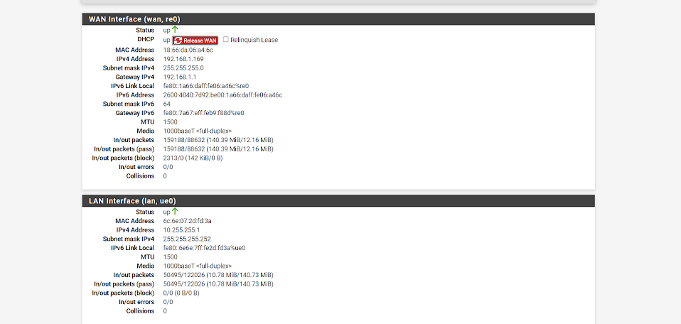
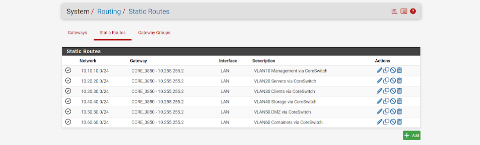

## Configuration Verification

The following pfSense outputs provide verification of the interface addressing and static routing used to connect the firewall to the HomeLab infrastructure.

### pfSense Interface Configuration

The pfSense interface status confirms that both network interfaces are operational.

The WAN interface (`re0`) is configured with `192.168.1.169/24` and provides connectivity to the upstream network.

The LAN interface (`ue0`) is configured with `10.255.255.1/30` and forms the routed transit connection between pfSense and the Cisco Catalyst 3850 core switch.

This configuration separates the upstream network from the internal HomeLab routing infrastructure while providing a dedicated Layer 3 connection to the core switch.

### Static Route Verification

Static routes were configured on pfSense so that internal VLAN networks located behind the Cisco Catalyst 3850 could be reached through the core switch.

The routing table shown below includes routes for:

- `10.10.10.0/24` — Management
- `10.20.20.0/24` — Servers
- `10.30.30.0/24` — Clients
- `10.40.40.0/24` — Storage
- `10.50.50.0/24` — DMZ
- `10.60.60.0/24` — Additional Services

Each network uses the `CORE_3850` gateway at `10.255.255.2`.

These routes provide the return path from pfSense to the internal VLAN networks routed by the Cisco Catalyst 3850.

---

## What This Demonstrates

This portion of the HomeLab demonstrates the integration of a firewall/router with a Layer 3 switched network.

The configuration evidence demonstrates:

- WAN and LAN interface configuration
- IPv4 addressing and subnetting
- A dedicated `/30` Layer 3 transit network
- Integration between pfSense and a Cisco Layer 3 core switch
- Static routing to multiple internal VLAN networks
- Separation between upstream and internal network infrastructure
- Verification of routing configuration through the pfSense WebGUI
