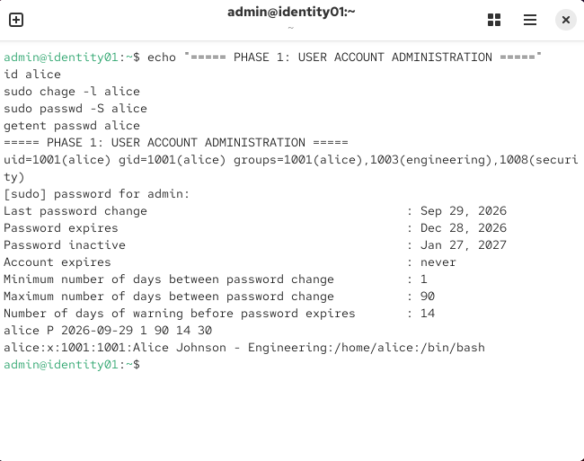
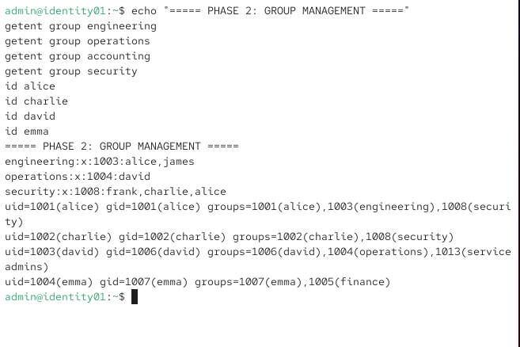
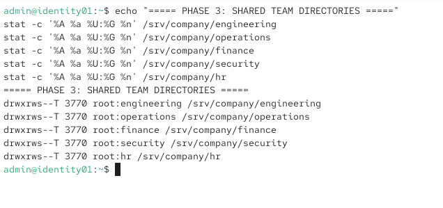
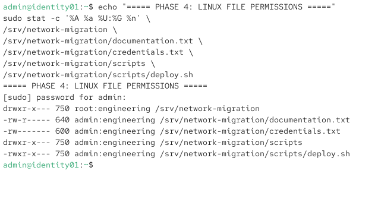
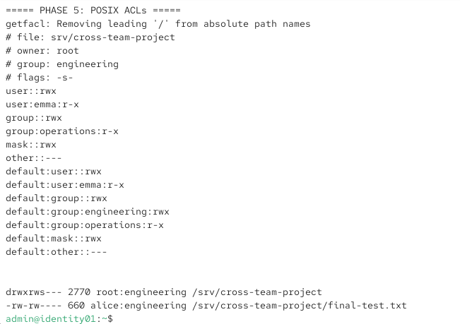
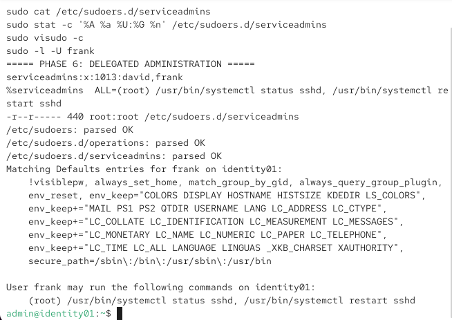
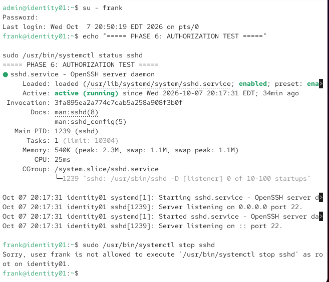

# Linux User Management Roadmap

## Overview

This project documents a structured Linux identity and access administration lab built on Rocky Linux.

The goal was to develop hands-on experience with common Linux system administration responsibilities including user lifecycle management, groups, password policies, shared resources, filesystem permissions, POSIX ACLs, and delegated administrative access.

Rather than only practicing individual commands, the project was organized into progressive phases. Each phase included configuration, verification, troubleshooting, and challenge exercises.

---

## Lab Environment

| Component | Configuration |
|-----------|---------------|
| Operating System | Rocky Linux 10.2 Minimal |
| Hostname | identity01 |
| Platform | VMware Workstation |
| Administration | Command Line / SSH |
| Privileged Access | sudo |
| Primary Focus | Linux Identity & Access Administration |

A dedicated virtual machine was created for the project so identity, permission, and privilege-management changes could be tested without affecting other systems.

---

# Phase 1 — User Account Administration

Phase 1 established the foundation for local Linux identity administration.

Tasks included:

- Creating and deleting local users
- Understanding UID and GID assignments
- Managing passwords
- Configuring password aging
- Locking and unlocking accounts
- Reviewing `/etc/passwd` and `/etc/shadow`
- Understanding account expiration vs. password expiration
- Investigating orphaned UID/GID ownership after account deletion

Password aging was configured using `chage`, including:

- Minimum password age: 1 day
- Maximum password age: 90 days
- Password expiration warning: 14 days
- Inactive period after expiration: 30 days

A lock/unlock exercise also demonstrated that locking an account prevents authentication without deleting the user's existing password.

## Phase 1 Verification

The final account state was verified using `id`, `chage`, `passwd`, and `getent`.

The output below verifies Alice's UID/GID assignments, supplementary group membership, password status, password-aging policy, home directory, and login shell.



### Skills Demonstrated

- `useradd`
- `userdel`
- `passwd`
- `chage`
- `id`
- `getent`
- UID/GID administration
- Password policy management
- Account lifecycle management

---

# Phase 2 — Groups & Membership

Phase 2 expanded the identity model from individual users into department-based groups.

Tasks included:

- Creating Linux groups
- Managing primary and supplementary groups
- Adding users to multiple groups
- Safely modifying group membership
- Changing primary groups
- Renaming groups
- Understanding GID persistence
- Testing group deletion restrictions
- Observing session behavior after group changes

An important part of this phase was understanding the difference between a user's primary group and supplementary groups.

The project also demonstrated that changing account group information does not automatically modify the ownership of files that already exist.

## Phase 2 Verification

The final group configuration was inspected using `getent` and `id`.



The current system state demonstrates multiple department memberships while users retain their individual primary groups.

The Phase 2 exercises also included a group rename operation to demonstrate that Linux associates filesystem ownership with numeric GIDs rather than only human-readable group names.

### Skills Demonstrated

- `groupadd`
- `groupmod`
- `groupdel`
- `usermod`
- `id`
- `groups`
- `getent`
- Primary groups
- Supplementary groups
- GID management

---

# Phase 3 — Shared Team Directories

Phase 3 applied group administration to shared departmental resources.

Shared directories were created under:

```text
/srv/company/
```

Department directories included:

- Engineering
- Operations
- Finance
- Security
- HR

Each directory was assigned to the appropriate department group and configured to support controlled team collaboration.

The directories use:

```text
3770
```

This combines standard Unix permissions with the **setgid** and **sticky** special permission bits.

Setgid causes newly created files and directories to inherit the directory's group ownership, supporting consistent departmental collaboration.

The sticky bit adds additional deletion protection within shared directories.

## Phase 3 Verification

The final directory state was verified using `stat`.



The output confirms departmental group ownership and mode `3770` across the shared directory structure.

### Skills Demonstrated

- `mkdir`
- `chmod`
- `chown`
- `chgrp`
- Shared directory administration
- Group-based collaboration
- setgid
- Sticky bit
- Permission inheritance
- File deletion controls

---

# Phase 4 — Linux File Permissions

Phase 4 focused on translating access requirements into traditional Linux filesystem permissions.

A network migration project was created under:

```text
/srv/network-migration
```

Different resources received different permissions according to their purpose.

| Resource | Permission | Purpose |
|----------|------------|---------|
| `/srv/network-migration` | `750` | Restricted project directory |
| `documentation.txt` | `640` | Group-readable documentation |
| `credentials.txt` | `600` | Sensitive owner-only file |
| `scripts/` | `750` | Restricted executable directory |
| `deploy.sh` | `750` | Owner/group executable script |

This exercise emphasized avoiding overly broad permissions and applying least privilege according to the sensitivity and function of each resource.

## Phase 4 Verification

The final permissions and ownership were verified using `stat`.



The output demonstrates that a single blanket permission was not applied recursively. Documentation, credentials, directories, and executable content each received permissions appropriate to their role.

### Skills Demonstrated

- Symbolic permissions
- Octal permissions
- `chmod`
- `chown`
- `chgrp`
- File vs. directory permission semantics
- Execute permissions
- Parent-directory traversal
- Least-privilege filesystem design

---

# Phase 5 — POSIX ACLs

Phase 5 extended traditional owner/group/other permissions using POSIX Access Control Lists.

A cross-team project directory was created at:

```text
/srv/cross-team-project
```

Engineering remained the primary collaborative group while additional access was granted to selected users and groups.

The ACL design included:

- Engineering group collaboration
- Named-user access for Emma
- Named-group access for Operations
- ACL masks
- Default ACL entries
- ACL inheritance
- setgid group inheritance
- No access for unauthorized users

This demonstrated how ACLs can provide more granular permissions without changing the primary ownership model.

## Phase 5 Verification

The final ACL was inspected with `getfacl`, while directory and file state were verified with `stat`.



The output demonstrates:

- `root` ownership with Engineering as the owning group
- Named-user ACL access for Emma
- Named-group ACL access for Operations
- An ACL mask controlling maximum effective permissions
- Default ACL entries for inheritance
- setgid enabled on the project directory
- Mode `2770` on `/srv/cross-team-project`
- Engineering group inheritance on newly created files

The resulting `final-test.txt` file is owned by `alice:engineering`, demonstrating that the collaborative group ownership model is functioning as intended.

### Skills Demonstrated

- `getfacl`
- `setfacl`
- Named-user ACLs
- Named-group ACLs
- ACL masks
- Effective permissions
- Default ACLs
- ACL inheritance
- setgid and ACL interaction
- Cross-team access control
- Permission troubleshooting

---

# Phase 6 — Sudo & Delegated Administration

Phase 6 moved from filesystem access control into administrative privilege delegation.

The objective was to allow selected users to perform specific administrative tasks without granting unrestricted root access.

A dedicated administrative group was created:

```text
serviceadmins
```

Users David and Frank were assigned to this role.

Members of `serviceadmins` were authorized to run only:

```text
/usr/bin/systemctl status sshd
/usr/bin/systemctl restart sshd
```

They were not granted permission to:

- Stop `sshd`
- Administer unrelated services
- Run arbitrary commands as root
- Receive unrestricted sudo access

Password authentication remained required.

This represents a least-privilege administrative model where users receive only the permissions necessary for their assigned responsibilities.

## Sudo Configuration Verification

The sudo policy was implemented through:

```text
/etc/sudoers.d/serviceadmins
```

The configuration was validated using `visudo`, the sudoers file was protected with mode `0440`, and Frank's effective privileges were inspected using `sudo -l`.



The verification output confirms:

- `serviceadmins` contains David and Frank
- `/etc/sudoers.d/serviceadmins` is owned by `root:root`
- The sudoers file uses mode `0440`
- `visudo -c` successfully parses the sudo configuration
- Frank can run `systemctl status sshd`
- Frank can run `systemctl restart sshd`
- No unrestricted administrative access was delegated

## Authorization Testing

Configuration alone was not considered sufficient verification, so the policy was tested directly from Frank's account.

The authorized command:

```text
sudo /usr/bin/systemctl status sshd
```

completed successfully and confirmed that the OpenSSH service was active and running.

An unauthorized attempt was then made using:

```text
sudo /usr/bin/systemctl stop sshd
```

Sudo explicitly denied the operation.



This test demonstrates that the least-privilege policy is actually enforced.

Frank can perform the administrative task assigned to his role but cannot perform a related administrative action that was not explicitly authorized.

### Skills Demonstrated

- `sudo`
- `visudo`
- `/etc/sudoers.d`
- Sudoers syntax
- Command-specific delegation
- Run-As restrictions
- Group-based administrative roles
- Command path matching
- Authentication requirements
- Allowed vs. denied authorization testing
- Least-privilege administration
- `systemctl`
- SSH service administration

---

# Troubleshooting & Validation

A major focus throughout this project was verifying configuration rather than assuming that a successful command produced the intended result.

Validation techniques included:

- `id` for user and group identity
- `getent` for account and group database queries
- `chage -l` for password-aging policies
- `passwd -S` for password and account state
- `stat` for filesystem ownership and permissions
- `getfacl` for ACL inspection
- `sudo -l` for effective sudo authorization
- `visudo -c` for sudoers syntax validation
- Switching between user accounts to test real access
- Confirming authorized operations succeed
- Confirming unauthorized operations fail

The project also demonstrated several behaviors important when troubleshooting Linux systems.

### Group Membership and Sessions

Changes to supplementary group membership do not automatically appear inside an existing login session.

A new login session may be required before the user receives the updated group membership.

### UID and GID Persistence

Linux filesystem ownership is associated with numeric UID and GID values.

Deleting a user or group does not automatically delete or reassign files previously owned by those numeric identifiers.

This can result in files displaying numeric ownership when the associated account or group no longer exists.

### Existing File Ownership

Changing a user's primary group does not retroactively modify the group ownership of files that already exist.

Newly created files use the current account and directory rules, while existing files retain their previous ownership until explicitly changed.

### Directory Traversal

File permissions alone do not determine whether a user can access a resource.

The user must also have the necessary execute permission on parent directories to traverse the complete path.

### ACL Masks

POSIX ACL masks can restrict the effective permissions of named users, named groups, and the owning group.

As a result, an ACL entry may appear to grant permissions that are reduced by the effective ACL mask.

### Exact Sudo Command Matching

Sudo authorization can depend on the exact executable path and arguments defined in the sudoers policy.

This makes command-specific delegation useful for providing limited administrative capabilities without granting a full privileged shell.

---

# What This Project Demonstrates

The six completed phases form a progression from basic Linux identity administration to controlled administrative delegation:

```text
User Accounts
     ↓
Groups
     ↓
Shared Resources
     ↓
Filesystem Permissions
     ↓
POSIX ACLs
     ↓
Delegated Administration
```

The project demonstrates hands-on experience with:

- Linux user lifecycle management
- UID and GID administration
- Password and account security
- Password-aging policies
- Primary and supplementary groups
- Department-based access models
- Shared Linux resources
- Linux file ownership
- Symbolic and octal permissions
- Special permission bits
- setgid directories
- Sticky bit behavior
- POSIX ACLs
- Default ACL inheritance
- ACL masks
- Cross-team access control
- Sudo policy configuration
- Command-specific privilege delegation
- Least-privilege administration
- SSH service administration
- Linux troubleshooting
- Configuration validation
- Technical documentation

The project emphasizes not only configuring Linux systems, but also validating that authorized access succeeds and unauthorized access is denied.

---

# Phase 7 — Final Enterprise Challenge

**Status: Planned**

Phase 7 will serve as the final enterprise-style challenge for the Linux User Management Roadmap.

The objective will be to apply concepts developed throughout Phases 1–6 in a less-guided scenario requiring identity administration, permissions, access control, troubleshooting, and validation.

Phase 7 will be added to this repository after completion.

---

## Project Status

| Phase | Topic | Status |
|------|-------|--------|
| Phase 1 | User Account Administration | Complete |
| Phase 2 | Groups & Membership | Complete |
| Phase 3 | Shared Team Directories | Complete |
| Phase 4 | Linux File Permissions | Complete |
| Phase 5 | POSIX ACLs | Complete |
| Phase 6 | Sudo & Delegated Administration | Complete |
| Phase 7 | Final Enterprise Challenge | Planned |
