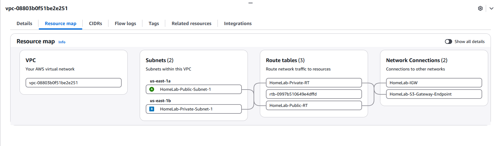
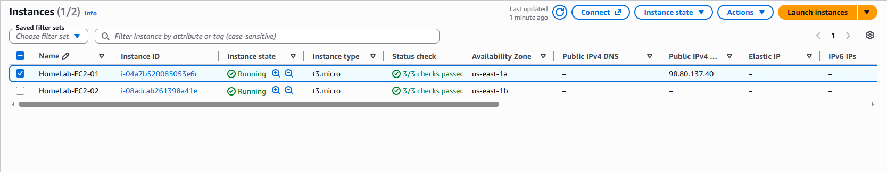

# AWS Cloud Infrastructure

[← Back to Main HomeLab](../README.md)

## Overview

This project documents the AWS cloud infrastructure deployed as an extension of my enterprise-style HomeLab.

The objective was to gain practical experience with AWS networking, Linux cloud instances, subnet segmentation, routing, and cloud security.

The environment was designed around a dedicated Virtual Private Cloud (VPC), separate public and private subnets, and two Amazon Linux EC2 instances.

The project emphasizes controlled administrative access, private workload isolation, and infrastructure verification.

---

## AWS Environment

| Component | Configuration |
|-----------|---------------|
| Cloud Provider | Amazon Web Services (AWS) |
| Region | us-east-1 |
| VPC CIDR | 10.100.0.0/16 |
| Public Subnet | 10.100.10.0/24 |
| Private Subnet | 10.100.20.0/24 |
| Public Availability Zone | us-east-1a |
| Private Availability Zone | us-east-1b |
| Operating System | Amazon Linux 2023 |
| EC2 Instance Type | t3.micro |
| Public Instance | HomeLab-EC2-01 |
| Private Instance | HomeLab-EC2-02 |

The environment uses separate Availability Zones for its public and private EC2 instances.

---

# 1. Virtual Private Cloud (VPC)

A dedicated VPC was configured using:

```text
10.100.0.0/16
```

The VPC provides an isolated AWS networking environment for the cloud infrastructure.

Within the VPC, two subnets were created to separate externally accessible administration resources from private workloads.

### Public Subnet

```text
HomeLab-Public-Subnet-1
CIDR: 10.100.10.0/24
Availability Zone: us-east-1a
```

The public subnet hosts the administration EC2 instance.

Its associated route table provides a default route through an Internet Gateway.

### Private Subnet

```text
HomeLab-Private-Subnet-1
CIDR: 10.100.20.0/24
Availability Zone: us-east-1b
```

The private subnet hosts an internal Linux instance without a public IPv4 address.

The private route table does not provide a default Internet route.

This design separates public administration from private workloads.

---

# 2. AWS Network Architecture

The AWS infrastructure follows this design:

```text
                  Internet
                     |
                     |
              Internet Gateway
                HomeLab-IGW
                     |
                     |
           AWS VPC 10.100.0.0/16
                     |
          +----------+----------+
          |                     |
          |                     |
     Public Subnet         Private Subnet
    10.100.10.0/24        10.100.20.0/24
          |                     |
          |                     |
     HomeLab-EC2-01        HomeLab-EC2-02
      Amazon Linux          Amazon Linux
       t3.micro              t3.micro
          |                     |
     Public IPv4           No Public IPv4
          |
          +---- SSH Bastion ----> Private EC2
```

The public EC2 instance serves as the controlled administrative entry point for accessing the private EC2 instance.

The private EC2 instance does not require its own public IPv4 address.

This environment does not use a site-to-site VPN or AWS Direct Connect connection.

---

# 3. VPC Resource Map Verification

The AWS VPC Resource Map was used to verify the deployed networking components.



The screenshot confirms the presence of:

- One dedicated VPC
- Public subnet in us-east-1a
- Private subnet in us-east-1b
- Three route tables
- Internet Gateway
- Amazon S3 Gateway Endpoint

The route tables shown include:

```text
HomeLab-Public-RT
HomeLab-Private-RT
```

The resource map provides visual verification that the AWS environment uses multiple subnets and dedicated routing components rather than a single flat network.

---

# 4. Route Tables & Internet Gateway

AWS route tables control traffic forwarding within the VPC.

### Public Route Table

The public subnet uses a route table containing:

```text
Destination       Target
10.100.0.0/16     Local
0.0.0.0/0         Internet Gateway
```

The local route provides connectivity within the VPC.

The default route provides a path toward external networks through the Internet Gateway.

Internet connectivity also depends on security groups, network ACLs, and instance configuration.

### Private Route Table

The private subnet uses a separate route table.

Its design includes:

- Local VPC routing
- No default route to the Internet Gateway
- An Amazon S3 Gateway Endpoint route

The absence of a default Internet route prevents the private instance from using a general Internet Gateway path.

This helps reduce unnecessary external network exposure.

### Skills Demonstrated

- AWS route table administration
- Default routing
- VPC local routing
- Internet Gateway configuration
- Public/private subnet design
- Cloud network isolation

---

# 5. Amazon S3 Gateway Endpoint

An Amazon S3 Gateway Endpoint was configured for the VPC.

```text
HomeLab-S3-Gateway-Endpoint
```

The endpoint provides a VPC-native route for accessing Amazon S3.

This allows resources in the private subnet to use the S3 endpoint without requiring a NAT Gateway or a general Internet route.

The endpoint appears in the AWS VPC Resource Map alongside the Internet Gateway.

This demonstrates an AWS networking feature used to support private access to cloud services.

---

# 6. EC2 Instance Deployment

Two Amazon Linux 2023 EC2 instances were deployed.

Both instances use the `t3.micro` instance type.

## Public EC2 Instance

```text
Instance Name: HomeLab-EC2-01
Operating System: Amazon Linux 2023
Instance Type: t3.micro
Availability Zone: us-east-1a
Private IPv4: 10.100.10.132
Subnet: Public
```

This instance has a public IPv4 address and serves as the AWS administration host.

It provides the entry point for SSH-based administration of the private instance.

## Private EC2 Instance

```text
Instance Name: HomeLab-EC2-02
Operating System: Amazon Linux 2023
Instance Type: t3.micro
Availability Zone: us-east-1b
Private IPv4: 10.100.20.212
Subnet: Private
Public IPv4: None
```

This instance is deployed without a public IPv4 address.

Administrative access is provided through the public EC2 instance rather than direct Internet connectivity.

---

# 7. EC2 Deployment Verification

The EC2 console was used to verify the final instance configuration.



The screenshot confirms:

| Property | HomeLab-EC2-01 | HomeLab-EC2-02 |
|----------|----------------|----------------|
| Instance State | Running | Running |
| Instance Type | t3.micro | t3.micro |
| Availability Zone | us-east-1a | us-east-1b |
| Public IPv4 | Assigned | None |
| Status Checks | 3/3 Passed | 3/3 Passed |

This evidence demonstrates that:

1. Both EC2 instances were successfully deployed.
2. Both instances were running when verified.
3. Both instances passed their EC2 status checks.
4. The instances were placed in separate Availability Zones.
5. Only the public administration instance had a public IPv4 address.

The absence of a public IPv4 address on HomeLab-EC2-02 supports the private workload design.

---

# 8. Bastion-Based SSH Administration

A bastion-based administration model was used to access the private EC2 instance.

The public instance serves as the SSH entry point.

The administrative path follows:

```text
On-Premises Administration
          |
          | SSH over Internet
          |
          v
    HomeLab-EC2-01
      Public Subnet
          |
          | SSH ProxyCommand
          |
          v
    HomeLab-EC2-02
      Private Subnet
```

This approach allows the private instance to remain without a public IPv4 address.

The original implementation used SSH ProxyCommand through the public instance to reach the private instance.

The management path was validated during the original project using successful remote connectivity tests.

### Security Benefits

- Avoids assigning a public IPv4 address to the private workload
- Provides a defined administrative entry point
- Separates public administration from internal workloads
- Reduces unnecessary direct Internet exposure
- Supports centralized SSH access management

---

# 9. AWS Security

Several security concepts were applied throughout the AWS environment.

## Security Groups

AWS security groups provide instance-level network traffic filtering.

They are used to control permitted inbound and outbound traffic for EC2 instances.

In this design, the intended security model is to limit administrative access to the required SSH communication paths.

## IAM Roles

The original AWS implementation used an EC2 IAM role to provide instance-based AWS permissions.

This demonstrates the use of IAM roles instead of relying on long-lived AWS access keys stored directly on instances.

## Instance Metadata Security

The EC2 environment was configured to require Instance Metadata Service Version 2 (IMDSv2).

IMDSv2 uses session-oriented metadata requests and provides additional protection compared with unrestricted legacy metadata access.

## Private Instance Isolation

The private EC2 instance has no public IPv4 address.

The private subnet also lacks a general Internet Gateway default route.

Together, these design choices help reduce the private instance's direct external network exposure.

---

# 10. Troubleshooting & Validation

The AWS implementation required verification of networking, instance placement, administrative connectivity, and resource configuration.

### Private Instance Administration

**Challenge:**

The private EC2 instance was intentionally deployed without a public IPv4 address.

Direct SSH administration from the Internet was therefore unavailable.

**Approach:**

Rather than assigning the private instance a public IPv4 address, the public EC2 instance was used as a bastion host.

SSH ProxyCommand provided a connection path through the public instance to the private workload.

**Validation:**

The original project confirmed successful connectivity to the private instance through the bastion-based administration path.

**Result:**

The private EC2 instance remained without a public IPv4 address while retaining a controlled administrative access path.

### Network Architecture Verification

The AWS VPC Resource Map was inspected to confirm the deployed network resources.

The EC2 console was inspected to verify:

- Instance state
- Instance type
- Availability Zone placement
- Public IPv4 assignment
- EC2 status checks

These verification steps helped confirm that the deployment matched the intended architecture.

---

# 11. Skills Demonstrated

This project demonstrates introductory hands-on experience with:

- AWS VPC administration
- CIDR addressing
- Public and private subnet design
- Availability Zones
- AWS route tables
- Local and default routing
- Internet Gateways
- Amazon S3 Gateway Endpoints
- EC2 instance deployment
- Amazon Linux administration
- Public and private IPv4 addressing
- SSH administration
- Bastion-host architecture
- SSH ProxyCommand
- AWS security groups
- IAM roles
- IMDSv2
- Cloud infrastructure isolation
- Cloud troubleshooting
- AWS Console verification
- Technical documentation

---

# Project Summary

This AWS infrastructure project demonstrates the deployment of a segmented cloud environment using a dedicated VPC, separate public and private subnets, and two Amazon Linux EC2 instances.

The public instance provides an administrative entry point while the private instance remains without a public IPv4 address.

The implementation also incorporates AWS routing, an Internet Gateway, an S3 Gateway Endpoint, IAM-based permissions, and instance metadata security.

The project provides practical experience with AWS networking, Linux cloud administration, security fundamentals, and infrastructure verification.

---

[← Back to Main HomeLab](../README.md)
